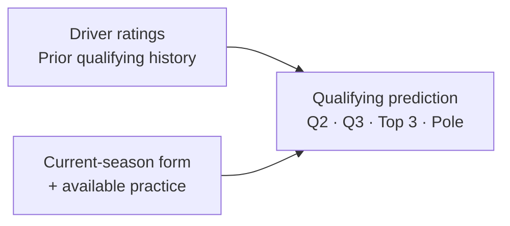

<div align="center">

# F1 Quali

**Formula 1 driver ratings & qualifying predictions**

[](https://www.python.org/) [](https://github.com/Sixian-Li/f1-quali/blob/main/LICENSE) [](https://github.com/Sixian-Li/f1-quali/blob/main/docs/method.md)

[Driver ratings](#driver-ratings) · [Current ratings](#current-driver-ratings-2026) · [Quick start](#quick-start) · [Results](#results) · [Documentation](#documentation)

</div>

F1 Quali estimates **driver qualifying ability across seasons** and predicts
**Q2, Q3, Top 3 and pole** for each event. Driver ratings are independently trained
outputs of the project, and also supply historical context to the prediction model.
Every rating and prediction has an explicit information cutoff.

## Driver ratings

Ratings update event by event, using qualifying results available before the next
prediction. The model separates teammate-relative ability, circuit affinity and
the contribution of final qualifying achievements.

| Rating | Scale | What it captures |
| --- | :---: | --- |
| **Driver ability** | **1&nbsp;–&nbsp;100** | Long-term teammate-relative performance, with season-level changes in form. |
| **Circuit affinity** | **1&nbsp;–&nbsp;10** | A driver's additional strength or weakness at a particular circuit layout. |
| **Composite qualifying rating** | **1&nbsp;–&nbsp;100** | Driver ability plus a bounded bonus for historical final qualifying performance. |

- **Comparable performances.** Teammate pace is compared in the last common
  qualifying segment: Q3 if both reach Q3, or Q1 if one is eliminated there.
  Final qualifying order and position gaps also contribute.
- **Long-term context.** Teammate links across seasons help account for the strength
  of the opposition. A positive weight floor plus exponential decay emphasizes
  recent evidence while retaining older comparisons.
- **Independent estimation.** Prediction training cannot change the ratings.
  Each historical prediction uses its own pre-event snapshot.

The displayed scores are **rating scales, not win percentages**. The composite
rating includes some car and seat effects; the teammate ability component remains
separately available. Sunday race results are not rating targets.
[Read the rating method →](https://github.com/Sixian-Li/f1-quali/blob/main/docs/method.md#independent-driver-ratings)

### Current driver ratings (2026)

The 22 drivers of the 2026 season, sorted from highest to lowest **composite
qualifying rating**. Snapshot taken before Round 15 (Azerbaijan): it includes all
qualifying through **R14 Spain** (data cutoff 2026-09-15 00:00 UTC). The roster is
the R14 entry list; the R15 entry list was not yet confirmed.

| # | Driver | Team | Composite rating | Driver ability |
| ---: | --- | --- | ---: | ---: |
| 1 | Max Verstappen | Red Bull | **92.9** | 88.3 |
| 2 | Charles Leclerc | Ferrari | **81.0** | 75.5 |
| 3 | Lando Norris | McLaren | **78.4** | 71.9 |
| 4 | Carlos Sainz Jr. | Williams | **77.9** | 75.9 |
| 5 | Lewis Hamilton | Ferrari | **75.5** | 67.1 |
| 6 | Fernando Alonso | Aston Martin | **73.3** | 72.8 |
| 7 | Oliver Bearman | Haas | **73.0** | 73.0 |
| 8 | George Russell | Mercedes | **72.7** | 68.1 |
| 9 | Gabriel Bortoleto | Audi | **69.6** | 69.6 |
| 10 | Pierre Gasly | Alpine | **69.4** | 69.4 |
| 11 | Oscar Piastri | McLaren | **68.1** | 61.9 |
| 12 | Arvid Lindblad | Racing Bulls | **66.0** | 65.4 |
| 13 | Nico Hülkenberg | Audi | **65.9** | 65.9 |
| 14 | Kimi Antonelli | Mercedes | **65.7** | 60.9 |
| 15 | Sergio Pérez | Cadillac | **57.0** | 56.9 |
| 16 | Esteban Ocon | Haas | **56.9** | 56.9 |
| 17 | Alexander Albon | Williams | **56.0** | 56.0 |
| 18 | Valtteri Bottas | Cadillac | **55.2** | 54.3 |
| 19 | Liam Lawson | Red Bull | **46.4** | 46.4 |
| 20 | Yuki Tsunoda | Racing Bulls | **39.1** | 39.1 |
| 21 | Franco Colapinto | Alpine | **37.5** | 37.5 |
| 22 | Lance Stroll | Aston Martin | **32.8** | 32.8 |

Both columns use the 1&nbsp;–&nbsp;100 scales above: they rank drivers relative to
each other and are not win percentages. The composite rating includes some car
effects; driver ability is the teammate-relative part alone. The values come from the fixed v6 rating chain; this package's rating
code reproduces them exactly from the verified source cache (see
[Data and reproduction](#data-and-reproduction)).

## How predictions work



The predictor combines ratings with **current-season information available before
qualifying**. It returns four probabilities per driver, nested selections and a
full-field ordering. Q2/Q3/Top 3 use regularized logistic models; pole uses an
event-level softmax model. Annual fits use earlier seasons, with the first five
events excluded from prediction-model training while inference remains available.

The selected method is **v6** (`memory_h12_mean_median_50_50`), the sixth research
iteration. It uses 18 inputs, with three current-season summaries blending a weighted
mean and median. Later experiments did not replace it. Package version `0.1.0`
identifies this standalone implementation.

## Quick start

Requires **Python 3.13**. After installation, the demo runs entirely offline.

```sh
python3.13 -m venv .venv
source .venv/bin/activate
python -m pip install -r requirements.lock
python -m pip install --no-deps --no-build-isolation -e .
f1-quali demo --output demo-run
```

The demo generates fictional data, builds driver ratings, fits an annual model and
produces **120 predictions across six events**.

| Explore | Output |
| --- | --- |
| Eventwise driver rating snapshots | `demo-run/prepared/ratings/` |
| Pool probabilities and predicted order | `demo-run/evaluation/predictions.parquet` |
| Demo summary | `demo-run/summary.json` |

Compare the summary with the [expected output](https://github.com/Sixian-Li/f1-quali/blob/main/examples/expected_demo_summary.json).
Synthetic results demonstrate the workflow; they are not evidence of real-world accuracy.

## Results

Comparison with rolling course-style OLS on **identical complete events**, from the
sixth round onward. Pool percentages measure **driver membership overlap**, not
exact finishing order. Lower rank MAE is better.

| Season · events | Method | Q2 | Q3 | Top 3 | Pole | Rank MAE ↓ |
| --- | --- | ---: | ---: | ---: | ---: | ---: |
| 2024 · 15 | Rolling OLS | 81.33% | 74.00% | 51.11% | 26.67% | 3.547 |
| 2024 · 15 | **v6** | 87.11% | 79.33% | 55.56% | 46.67% | 2.907 |
| 2026 · 8¹ | Rolling OLS | 91.41% | 88.75% | 58.33% | 37.50% | 2.011 |
| 2026 · 8¹ | **v6** | 94.53% | 87.50% | 50.00% | 25.00% | 1.830 |

¹ 2026 data through R14.

v6 reduces full-field rank error in both comparisons, but does not consistently
improve Top 3 or pole. Both methods identify **37 of 69 Top 3 slots** across these
two years. These periods have already been inspected and are not untouched tests.

[Full yearly scorecard](https://github.com/Sixian-Li/f1-quali/blob/main/benchmarks/v6_yearly.csv) ·
[Training years and coverage](https://github.com/Sixian-Li/f1-quali/blob/main/benchmarks/training_years.csv) ·
[Results and limitations](https://github.com/Sixian-Li/f1-quali/blob/main/docs/results_and_limitations.md)

## Data and reproduction

The fixed study uses **2016–2026** prediction data, through **2026 R14**, plus reviewed
**2010–2015 history for rating warmup**. Sources include F1DB `v2026.14.0`, versioned
schedules and official evidence; the data cutoff is **2026-09-15**.

> **Historical reproduction has a known source limitation.** A fresh-cache download
> on 2026-09-26 stopped when a required Formula 1 webpage did not match its recorded
> byte checksum. Exact historical replay requires the verified original cache,
> which is not distributed. The demo and tests are reproducible independently;
> the full download recipe currently is not. [Source check](https://github.com/Sixian-Li/f1-quali/blob/main/benchmarks/source_acquisition.json).

<details>
<summary><strong>Historical data, training and evaluation commands</strong></summary>

With the verified snapshots already in `data/raw`:

```sh
f1-quali data --cache data/raw --output data/canonical --offline
f1-quali prepare --data data/canonical --output runs/prepared
f1-quali train --prepared runs/prepared --year 2026 --output runs/models/2026
f1-quali evaluate --prepared runs/prepared --model runs/models/2026 --output runs/evaluations/2026
f1-quali baseline --data data/canonical --years 2024 2026 --output runs/baselines
```

Omitting `--offline` attempts remote acquisition, subject to the limitation above.
Downloaded files must match registered hashes. Changed snapshots require explicit
review and a new data identity. No raw source archive or pretrained model is bundled.
The package is a research workflow rather than an automatic live feed.

See [data and reproduction](https://github.com/Sixian-Li/f1-quali/blob/main/docs/data_and_reproduction.md)
for the full workflow, cutoff contract and new-event prediction inputs.

</details>

## Documentation

| Guide | Contents |
| --- | --- |
| [Method](https://github.com/Sixian-Li/f1-quali/blob/main/docs/method.md) | Rating definitions, historical weighting, features, models and losses. |
| [Data and reproduction](https://github.com/Sixian-Li/f1-quali/blob/main/docs/data_and_reproduction.md) | Source versions, availability rules and the complete workflow. |
| [Results and limitations](https://github.com/Sixian-Li/f1-quali/blob/main/docs/results_and_limitations.md) | Yearly performance, evaluation boundaries and weaknesses. |
| [Research journey · 研究回顾](https://github.com/Sixian-Li/f1-quali/blob/main/docs/research_journey.md) | Why the project evolved from OLS to ratings and pool prediction, in Chinese. |

<details>
<summary><strong>Development and numerical verification</strong></summary>

```sh
python -m pytest -W error
ruff check src tests scripts
python -m build --no-isolation
```

[GitHub Actions](https://github.com/Sixian-Li/f1-quali/actions/workflows/tests.yml)
runs offline tests, package builds and the demo on Linux and macOS. Full historical
replay is a separate release check and does not run in ordinary CI.

The standalone refactor reproduced **228 rating snapshots, 4,629 feature rows,
all 11 annual model records and all historical predictions** against the author's
unpublished v6 research implementation (lock `763e7f1871a6a6d3`). Maximum input and
probability differences were zero in the tested macOS arm64 environment.
[Verification record](https://github.com/Sixian-Li/f1-quali/blob/main/benchmarks/refactor_verification.json) ·
[Contributing](https://github.com/Sixian-Li/f1-quali/blob/main/CONTRIBUTING.md)

</details>

## License and sources

[MIT](https://github.com/Sixian-Li/f1-quali/blob/main/LICENSE) · Copyright 2026 **Sixian Li**.

Underlying data and third-party materials retain their own terms. Sources include
[F1DB](https://github.com/f1db/f1db), [f1schedule](https://github.com/theOehrly/f1schedule)
and official FIA / Formula 1 documents. See [third-party notices](https://github.com/Sixian-Li/f1-quali/blob/main/THIRD_PARTY_NOTICES.md).
This is an independent project with no official affiliation.
