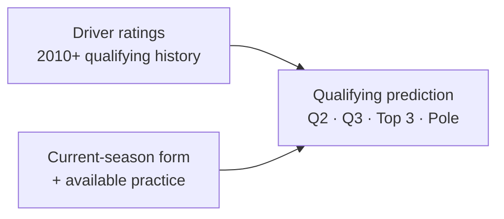

<div align="center">

# F1 Quali

**Formula 1 driver ratings & qualifying predictions**

[](https://www.python.org/) [](https://github.com/Sixian-Li/f1-quali/blob/main/LICENSE) [](https://github.com/Sixian-Li/f1-quali/blob/main/docs/rm.md)

[RM chart · English](https://sixian-li.github.io/f1-quali/en.html) · [中文](https://sixian-li.github.io/f1-quali/) · [RM ratings](https://github.com/Sixian-Li/f1-quali/blob/main/ratings/README.md) · [Rating method](#driver-ratings) · [Quick start](#quick-start) · [Results](#results) · [Documentation](#documentation)

</div>

F1 Quali estimates **driver qualifying ability across seasons** and predicts
**Q2, Q3, Top 3 and pole** for each event. The ratings are published outputs in
their own right, and they also give the prediction model historical context.
Every rating and prediction has an explicit information cutoff.

**Explore the RM rating chart: [English](https://sixian-li.github.io/f1-quali/en.html) · [中文](https://sixian-li.github.io/f1-quali/)**
Compare any of 84 drivers with data from 2010–2026, through **2026 Round 14**.
Select years, zoom, set each of two trailing moving-average windows independently,
and export your selection as CSV. Switch languages in the page header; your
driver selection, years, zoom and smoothing settings are shared when browser
storage is available. No installation or account is required.
The chart maps historical RM percentiles to a normal display scale with
**mean/median 6.5 and standard deviation 2**. Scores may exceed 10 or fall below 0.
Both moving averages are calculated on original RM scores before this mapping;
hover and CSV retain those original scores.
RM allows greater changes for less-experienced drivers and places more weight on
recent qualifying results. **RM is also the default Python/CLI method in 0.3.0**;
the chart and leaderboard now use the same model and display mapping.
[Chart method, controls and limitations](docs/rating_explorer.md).

## Driver ratings

Ratings update event by event, using only qualifying results available before the
next prediction. The model separates teammate-relative ability, circuit affinity
and the contribution of each driver's own final qualifying positions.

| Rating | Scale | What it captures |
| --- | :---: | --- |
| **Driver ability** | **1&nbsp;–&nbsp;100** | Long-term teammate-relative performance, with season-level changes in form. |
| **Circuit affinity** | **1&nbsp;–&nbsp;10** | A driver's additional strength or weakness at a particular circuit layout. |
| **Original RM composite** | **1&nbsp;–&nbsp;100** | Driver ability plus a bounded bonus for recent final qualifying positions. |
| **Displayed RM rating** | **Mean 6.5, SD 2** | A fixed normal-percentile mapping of the original composite; values can exceed 10. |

- **Comparable performances.** Teammate pace is compared in the last common
  qualifying segment: Q3 if both reach Q3, or Q1 if one is eliminated there.
  Final qualifying order and position gaps also contribute.
- **Long-term context.** Teammate links across seasons (from 2010) help account for
  the strength of the opposition, with a weight floor that keeps old comparisons.
- **More room for rookie changes.** Annual-state variance is larger when a driver
  has fewer prior qualifying appearances, allowing faster changes in either direction.
- **Recent results matter most.** The final-position bonus uses each driver's own
  valid results, even when another entrant in that session was disqualified. It has
  no permanent floor: its average has a three-month half-life, while reliability
  retains a one-year half-life and prior mass 20.
- **Small learned corrections.** Five shared rules, fitted on earlier seasons against
  Top 3 prediction accuracy, nudge ability and circuit affinity using each driver's
  recent teammate surprises. They are bounded and have no per-driver parameters.

The displayed scores are **rating scales, not win percentages**. The composite
rating includes some car and seat effects; the teammate ability component remains
separately available. Sunday race results are not rating targets.
[Read the RM method →](docs/rm.md)

### Current driver ratings (2026)

> **[View all 22 driver ratings — after 2026 Round 14 →](https://github.com/Sixian-Li/f1-quali/blob/main/ratings/README.md)**
>
> Spanish Grand Prix · sorted by composite rating · includes teammate ability,
> team and the snapshot cutoff. Top three on the mapped scale: Verstappen 10.94, Norris 9.58, Leclerc 9.07.

## How predictions work



The predictor combines ratings with **current-season information available before
qualifying**. It returns four probabilities per driver, nested selections and a
full-field ordering. Q2/Q3 use regularized logistic models, Top 3 a quota-constrained
Brier model trained jointly with the rating corrections, and pole an event-level
softmax. Each annual model is fitted only on earlier seasons (back to 2010), with the
first five events of each season excluded from fitting while inference remains available.

The selected method is **RM**, package version **0.3.0**. It preserves m1r1's
18 prediction inputs, annual shared correction rules, and four-pool heads, while
adding career-dependent annual variance and a shorter achievement mean memory.
The original **m1r1** and **v6** remain available through `--method m1r1` and
`--method v6` on `prepare` and `demo`. Other commands follow the input artifact's
method. [RM details and compatibility](docs/rm.md).

## Quick start

Requires **Python 3.13**. After installation, the demo runs entirely offline.

```sh
python3.13 -m venv .venv
source .venv/bin/activate
python -m pip install -r requirements.lock
python -m pip install --no-deps --no-build-isolation -e .
f1-quali demo --output demo-run
```

The demo generates fictional data, builds driver ratings, fits an annual RM model
and produces **120 predictions across six events**.

| Explore | Output |
| --- | --- |
| Eventwise driver rating snapshots | `demo-run/prepared/ratings/` |
| Pool probabilities and predicted order | `demo-run/evaluation/predictions.parquet` |
| Demo summary | `demo-run/summary.json` |

Compare the summary with the [expected output](https://github.com/Sixian-Li/f1-quali/blob/main/examples/expected_demo_summary.json).
Synthetic results demonstrate the workflow; they are not evidence of real-world accuracy.

## Results

Comparison with rolling course-style OLS on **identical complete events**, from the
sixth round onward. Pool percentages measure **driver membership overlap**, not
exact finishing order. Lower rank MAE is better.

| Period · events | Method | Q2 | Q3 | Top 3 | Pole | Rank MAE ↓ |
| --- | --- | ---: | ---: | ---: | ---: | ---: |
| 2017–2022 validation · 72 | Rolling OLS | 88.13% | 76.30% | 69.44% | 36.11% | 2.888 |
| 2017–2022 validation · 72 | **RM** | 90.87% | 82.88% | 79.63% | 47.22% | 2.297 |
| 2023–2026 already seen · 48 | Rolling OLS | 83.57% | 77.08% | 57.64% | 27.08% | 3.283 |
| 2023–2026 already seen · 48 | **RM** | 86.04% | 77.92% | 63.89% | 39.58% | 3.012 |
| 2026 · 8 | Rolling OLS | 91.41% | 88.75% | 58.33% | 37.50% | 2.011 |
| 2026 · 8 | **RM** | 93.75% | 87.50% | 50.00% | 37.50% | 1.784 |

2026 data are through R14. Validation Q2/Q3 use 73 complete events; the other
validation metrics use 72. Each task keeps its own denominator.

RM finds **172 of 216** Top 3 slots in validation (OLS 150) and **92 of 144**
afterwards (OLS 83). In 2026 it still finds only **12 of 24**, versus OLS's 14.
Relative to m1r1, RM's 2026 pole hits rise from 2 to 3 of 8, while Q3 hits fall
from 71 to 70 of 80 and Top3 normalized Brier worsens from 0.688519 to 0.692681.
The choice of RM reflects the preferred rating response, not a clean sweep of
prediction metrics. All displayed years have already been inspected during research.

[RM yearly scorecard](benchmarks/rm_yearly.csv) ·
[Baseline comparison](benchmarks/rm_baseline_comparison.csv) ·
[Training years](benchmarks/rm_training_years.csv) ·
[Preserved m1r1 scorecard](benchmarks/m1r1_yearly.csv) ·
[Results and limitations](docs/results_and_limitations.md)

## Data and reproduction

The fixed study uses **2010–2026** data, through **2026 R14**. 2016–2026 come from
reviewed canonical tables; **2010–2015 is a retrospective reconstruction** whose
actual session clocks are unknown, so early practice is admitted by reviewed session
order and results count as available from a conservative race-date bound. Sources
include F1DB `v2026.14.0`, versioned schedules and official evidence; the data
cutoff is **2026-09-15**.

> **Historical reproduction has a known source limitation.** A fresh-cache download
> on 2026-09-26 stopped when a required Formula 1 webpage did not match its recorded
> byte checksum. Exact historical replay requires the verified original cache,
> which is not distributed. The demo and tests are reproducible independently;
> the full download recipe currently is not. [Source check](https://github.com/Sixian-Li/f1-quali/blob/main/benchmarks/source_acquisition.json).

<details>
<summary><strong>Historical data, training, evaluation and rating commands</strong></summary>

With the verified snapshots already in `data/raw`:

```sh
f1-quali data --cache data/raw --output data/canonical --offline
f1-quali full-era --data data/canonical --cache data/raw --output data/full_era --offline
f1-quali prepare --data data/full_era --output runs/prepared
f1-quali train --prepared runs/prepared --year 2026 --output runs/models/2026
f1-quali evaluate --prepared runs/prepared --model runs/models/2026 --output runs/evaluations/2026
f1-quali ratings --prepared runs/prepared --model runs/models/2026 \
  --cutoff 2026-09-25T11:00:00Z --output runs/ratings
f1-quali baseline --data data/canonical --years 2024 2026 --output runs/baselines
```

Omitting `--offline` attempts remote acquisition, subject to the limitation above.
Downloaded files must match registered hashes. Changed snapshots require explicit
review and a new data identity. No raw source archive or pretrained model is bundled.
The package is a research workflow rather than an automatic live feed.

See [data and reproduction](https://github.com/Sixian-Li/f1-quali/blob/main/docs/data_and_reproduction.md)
for the full workflow, cutoff contract, new-event predictions and m1r1/v6 commands.

</details>

## Documentation

| Guide | Contents |
| --- | --- |
| [RM method](docs/rm.md) | Rookie variance, recent-result memory, fixed display mapping and compatibility. |
| [Shared method and m1r1](docs/method.md) | Rating definitions, historical weighting, features, models and losses. |
| [Data and reproduction](https://github.com/Sixian-Li/f1-quali/blob/main/docs/data_and_reproduction.md) | Source versions, availability rules and the complete workflow. |
| [Results and limitations](https://github.com/Sixian-Li/f1-quali/blob/main/docs/results_and_limitations.md) | Yearly performance, evaluation boundaries and weaknesses. |
| [Research journey · 研究回顾](https://github.com/Sixian-Li/f1-quali/blob/main/docs/research_journey.md) | Why the project evolved from OLS to ratings, pool prediction and m1r1, in Chinese. |

<details>
<summary><strong>Development and numerical verification</strong></summary>

```sh
python -m pytest -W error
ruff check src tests scripts
python -m build --no-isolation
```

[GitHub Actions](https://github.com/Sixian-Li/f1-quali/actions/workflows/tests.yml)
runs offline tests, package builds and the demo on Linux and macOS. Full historical
replay is a separate release check and does not run in ordinary CI.

The RM port independently rebuilt the fixed data, **1,428 annual experience
profiles, 343 eventwise rating networks, 7,226 input rows, all 17 annual models,
7,226 historical predictions, and 82 ratings across four endpoint snapshots**.
All compared numbers match the chosen research RM case exactly in the tested
macOS arm64 environment. The public model adds its method identity; this is a
numerical migration check, not evidence of future forecast accuracy.
[RM verification](benchmarks/rm_verification.json) ·
[Preserved m1r1 verification](benchmarks/m1r1_verification.json) ·
[v6 verification](benchmarks/refactor_verification.json) ·
[Contributing](CONTRIBUTING.md)

</details>

## License and sources

[MIT](https://github.com/Sixian-Li/f1-quali/blob/main/LICENSE) · Copyright 2026 **Sixian Li**.

Underlying data and third-party materials retain their own terms. Sources include
[F1DB](https://github.com/f1db/f1db), [f1schedule](https://github.com/theOehrly/f1schedule)
and official FIA / Formula 1 documents. See [third-party notices](https://github.com/Sixian-Li/f1-quali/blob/main/THIRD_PARTY_NOTICES.md).
This is an independent project with no official affiliation.
